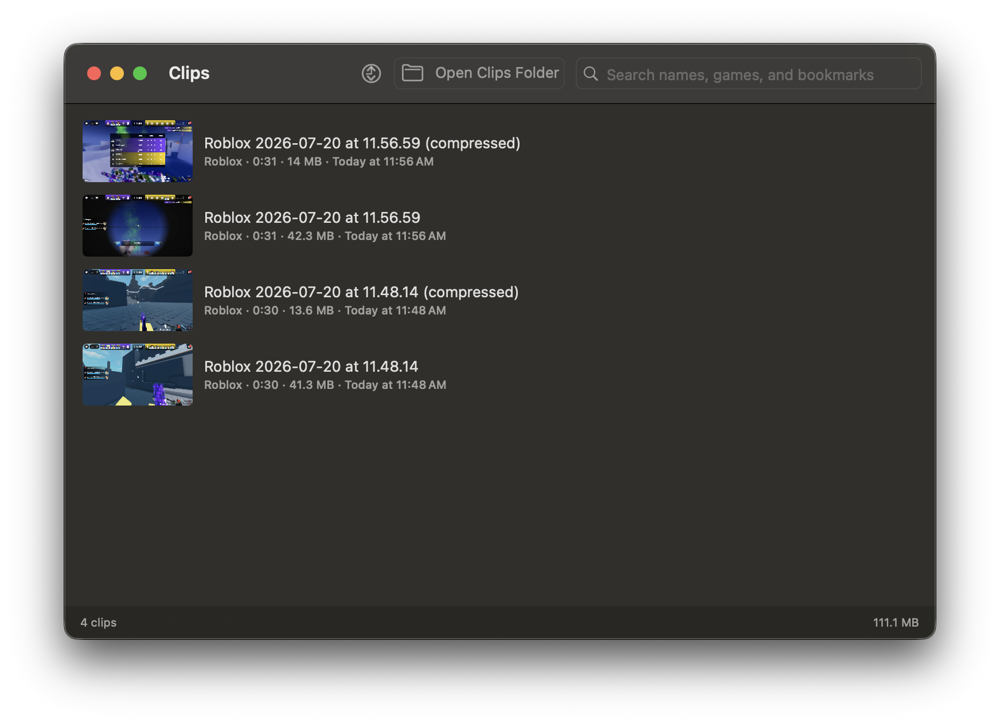
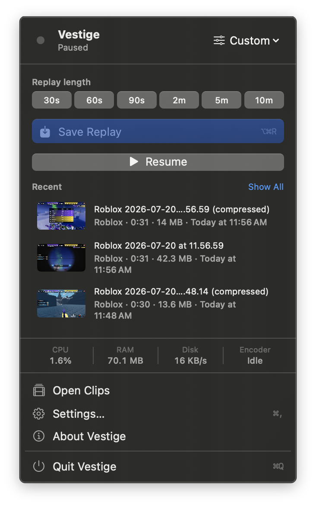
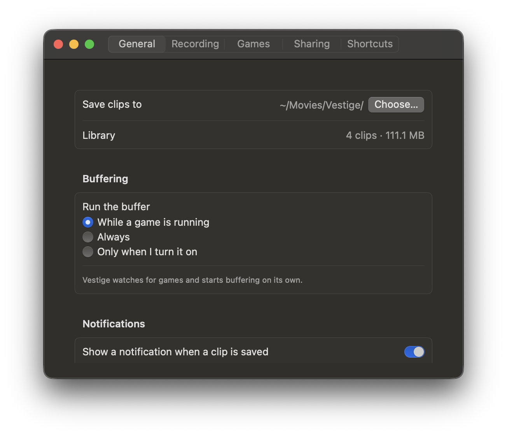

<div align="center">
  

  # Vestige

  **The replay buffer Mac gaming has been missing.**

  Save the moment after it happens. Vestige keeps the last few seconds or
  minutes of gameplay in memory, then turns it into a local MP4 when you press
  a hotkey.

  <br>

  <a href="downloads/Vestige-1.0.1-unnotarized.dmg?raw=1">Download DMG</a>
  ·
  <a href="#install">Install</a>
  ·
  <a href="#first-run">First run</a>
  ·
  <a href="docs/ARCHITECTURE.md">Architecture</a>
</div>

<br>

<p align="center">
  
</p>

<p align="center">
  <strong>No accounts.</strong>
  <strong>No cloud.</strong>
  <strong>No telemetry.</strong>
  <strong>No network code.</strong>
</p>

## Why Vestige

Mac games finally deserve the same "clip that" muscle memory PC players get
from ShadowPlay. Vestige lives in your menu bar, watches for games, keeps a
rolling replay buffer, and saves the last moment as a regular MP4.

It is built natively for macOS with ScreenCaptureKit, VideoToolbox, AVFoundation,
and SwiftUI. The buffer stays in RAM until you save. Your clips stay in a folder
you choose.

## What It Feels Like

<table>
  <tr>
    <td width="34%" valign="top">
      
    </td>
    <td width="66%" valign="top">
      
    </td>
  </tr>
</table>

| What you do | What Vestige handles |
| --- | --- |
| Press `⌥⌘R` after a clutch play | Saves the current replay buffer as an MP4 |
| Pick 30 seconds, 1 minute, or 10 minutes | Keeps that much compressed footage in RAM |
| Play a detected game | Starts buffering automatically |
| Save a shorter cut | Exports the last 15, 30, or 60 seconds |
| Share to Discord | Compresses to a size target and can copy the clip |
| Build a clip library | Search, sort, favorite, rename, and play clips locally |

## Highlights

**For playing**

- Menu bar app with no Dock icon to manage.
- Automatic game detection, plus a manual game list.
- Window-only capture so the game is recorded cleanly without your desktop.
- Replay presets from 30 seconds to 10 minutes, plus custom lengths.
- Rebindable shortcuts for saving, pausing, opening clips, and toggling mic.

**For clean clips**

- Hardware HEVC or H.264 encoding.
- System audio and microphone toggles, with mic off by default.
- Quick exports for the last 15, 30, or 60 seconds.
- Background compression presets for Discord 10 MB, Nitro 50 MB, or quality.
- Choose HEVC for the best picture at a given size, or H.264 for wider playback.
- Optional clipboard copy after saving.

**For owning your files**

- Local MP4 files in `~/Movies/Vestige` by default.
- Clip library with search, favorites, sorting, and rename-on-disk.
- Optional retention rules that keep favorites and renamed clips.
- Diagnostics for capture, permissions, audio, and the full replay pipeline.

## Install

Vestige requires **macOS 14 Sonoma or later** and a Mac with hardware video
encoding. Apple silicon is recommended.

### Option 1: Download the DMG

Download [Vestige-1.0.1-unnotarized.dmg](downloads/Vestige-1.0.1-unnotarized.dmg?raw=1),
open it, and drag **Vestige** into **Applications**.

This DMG is not notarized by Apple, so macOS will warn that it cannot verify the
developer. To open it anyway, right-click **Vestige** and choose **Open**, or try
opening it once and then use **System Settings -> Privacy & Security -> Open
Anyway**. If you prefer not to bypass that warning, build from source instead.

### Option 2: Build from source

Use the **Code** button on this repository to copy its clone URL, then run:

```bash
git clone https://github.com/sandeepwastaken/vestige
cd vestige
./Scripts/build-app.sh --run
```

The build script creates `dist/Vestige.app`, installs it to `/Applications`, and
launches it.

## First Run

1. Launch **Vestige**. It appears in the menu bar.
2. Grant **Screen Recording** when macOS asks.
3. Quit and reopen Vestige. macOS only gives capture access to apps launched
   after the permission is granted.
4. Start a game. Vestige begins buffering automatically with the default profile.
5. Press `⌥⌘R` to save the last minute.

Your clips are saved to `~/Movies/Vestige` unless you choose another folder in
**Settings -> General**.

## Permissions

| Permission | Why Vestige asks | When it appears |
| --- | --- | --- |
| Screen Recording | Capturing the game window or display | First launch |
| Microphone | Recording your mic in clips | Only if you enable mic capture |
| Notifications | Showing "clip saved" banners | First launch, optional |

Vestige does **not** ask for Accessibility access. Global shortcuts use Carbon's
`RegisterEventHotKey`, which reports only the shortcut you configured.

macOS ties Screen Recording permission to the app's code signature. If you build
from source repeatedly, run this once to create a stable local signing identity:

```bash
./Scripts/make-signing-cert.sh
```

## Settings That Matter

| Setting | Good default | Change it when |
| --- | --- | --- |
| Replay length | 1 minute | You want raid-length saves or tiny instant clips |
| Capture mode | Game window | You need full-display capture |
| Codec | HEVC | A sharing target needs H.264 compatibility |
| System audio | On | You want silent clips |
| Microphone | Off | You want voice comms or commentary captured |
| Compression | Off | You regularly paste clips into Discord |
| Compressed format | HEVC | A target needs H.264 for inline playback |

## Troubleshooting

Vestige includes command-line diagnostics in the app bundle:

```bash
/Applications/Vestige.app/Contents/MacOS/Vestige --self-test
/Applications/Vestige.app/Contents/MacOS/Vestige --permissions
/Applications/Vestige.app/Contents/MacOS/Vestige --audio-test
/Applications/Vestige.app/Contents/MacOS/Vestige --pipeline-test
```

To inspect local logs:

```bash
log show --predicate 'subsystem == "app.vestige.Vestige"' --last 10m --info
```

## Privacy Model

Vestige's privacy model is intentionally boring:

- No accounts, sign-in, sync, telemetry, ads, analytics, or update checks.
- No networking dependency and no network code path.
- The replay buffer lives in memory until you save.
- Clips are plain MP4 files that remain on your Mac.
- Uninstalling Vestige does not remove your clips.

## How It Works

```text
ScreenCaptureKit -> VideoToolbox -> ring buffer in RAM -> hotkey -> AVAssetWriter -> MP4
```

Frames are compressed while they are captured, so a replay buffer stores
compressed samples instead of raw video. Saving a clip is a fast mux operation,
not a full re-encode. The implementation details are documented in
[docs/ARCHITECTURE.md](docs/ARCHITECTURE.md).

## Contributing

Contributions are welcome. Start with [CONTRIBUTING.md](CONTRIBUTING.md), then
read [docs/ARCHITECTURE.md](docs/ARCHITECTURE.md) before changing capture,
encoding, or buffer behavior.

Project guardrails:

- Swift 6 strict concurrency.
- Zero warnings.
- No new dependencies unless they are truly necessary.
- No network code.

## License

MIT. See [LICENSE](LICENSE).

Copyright (c) 2026 the Vestige contributors.
